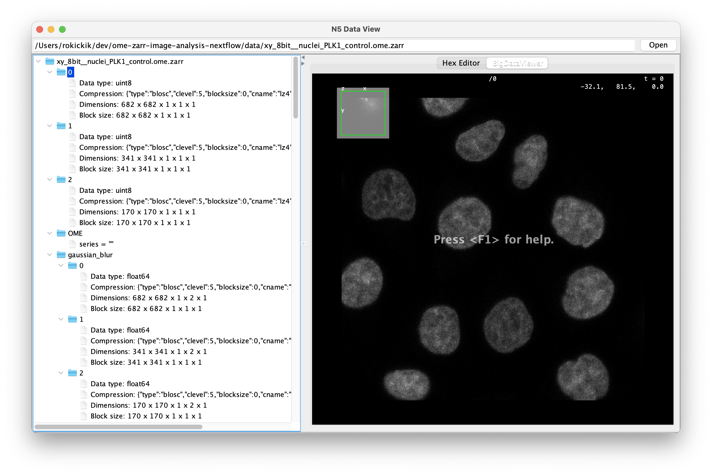
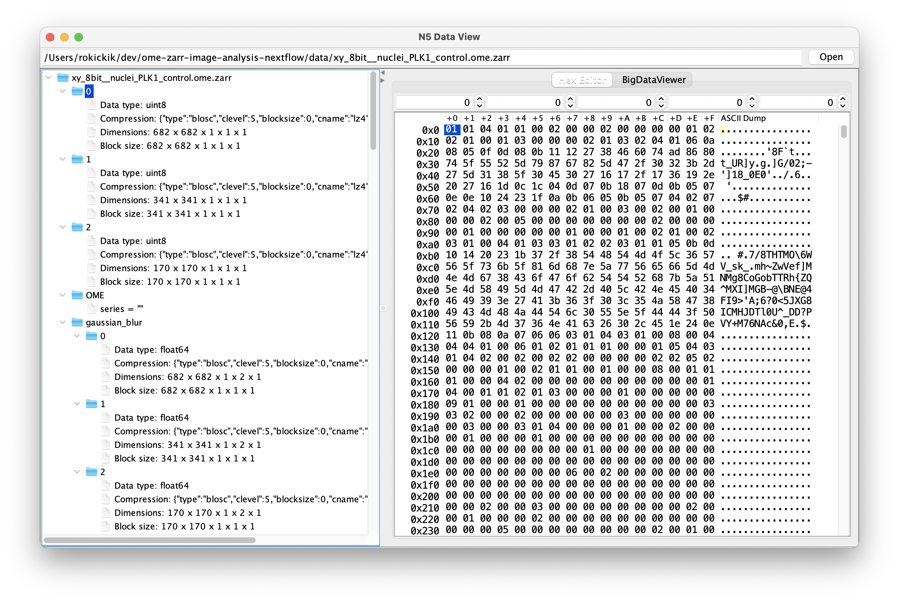

# N5 Inspector

This is a data and metadata inspector for file formats supported by the N5 API, including N5, HDF5, and OME-Zarr. 

It was inspired by the [HDF View](https://www.hdfgroup.org/downloads/hdfview/) application.

## Usage

Note that this is an early prototype hacked together in a few hours. You need a Java IDE to run the development prototype. 
Import the Maven project and run the main method of `org.janelia.n5.inspector.N5Inspector`. You may need to install the [Blosc](https://www.blosc.org/) library to open certain files.

